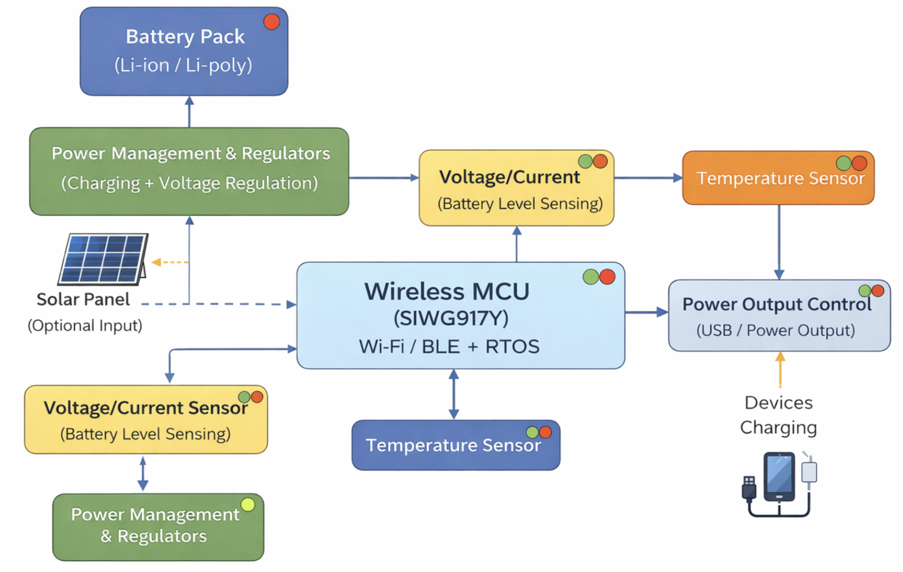

# a11g-final-submission

**Team Number:** 34

**Team Name:** T34

| Team Member Name | Email Address          | GitHub Handle |
| ---------------- | ---------------------- | ------------- |
| Dhruva Jindal    | djindal@seas.upenn.edu | jindaldhruva  |
| Benjamin Abt     | bencabt@seas.upenn.edu | bencabt       |

**GitHub Repository URL:** https://github.com/ese5160/a11g-final-submission-s26-s26-t34

## 1. Video Presentation

[Demo](https://youtu.be/_I91xZLqs-A)

## 2. Project Summary

Device Description:

- The device is an IOT power bank, allowing one to monitor the charging of their devices remotely, turning it on and off as desired. The device has an integrated solar panel, giving your devices extra juice even if the on board batteries are dead.
- The project was inspired by a desire to learn about power circuits, giving us a perfect platform to do so. The added solar panel solves a problem we often experience, that being, a dead power bank is useless.
- Usage of internet connectivity allows us to monitor the device remotely, as well as control it.

Device Functionality:

- The device is designed to take in power via 2x batteries and 1x solar panel. ICs convert power to charge the connected device, as well as to provide power for the device peripherals.
- The device has 2x I2C voltage and current sensors, an SPI controlled display, a solar panel, and provisions for over the air firmware updates.

Project Challenges:

- Manufacturing challenges made it such that the PCB was delivered extremely late, severely impacting our ability to integrate the system.
- The tight packaging of the PCBA prevented the manufacturer from soldering on all components, requiring this to be done by hand after receiving the PCB.
- There were many problems with the IC circuits, requiring components to be removed and new ones to be installed. Upon diligent efforts to get the circuit functioning correctly, it was found that the chip was unable to be flashed with firmware, a common issue that many teams faced.
- In an effort to show functionality, a dev board was utilized, allowing us to demonstrate the capabilities we had originally outlined.
- We also faced issues with I2C, likely a result of task priorities causing the clock line to not function as desired.

Prototype Learnings:

- A miriad of lessons were learned building this prototype. We learned how to design a power intensive circuit, design and route an extrememly crowded PCB, and write RTOS firmware to work with the PCB that implemented MQTT. This was our first time using both Simplicity Studios and Altium, both which had a steep yet rewarding learning curve.
- Many issues with this device were a function of timeline. In a second implementation, we would start the firmware much earlier in the design cycle, allowing us to better work out kinks with SPI and I2C.

Next Steps and Takeaways:

- With the addition of a working chip, next steps would be to fix the task issues related to I2C, finish writing our SPI firmware, and fully integrating the packaging of the device.
- The takeaways from the course are enormous as this course is one of the best that Penn has to offer. Takeaways include learning how to design such a circuit, designing and building a PCB, full firmware writing and integration, MQTT, and wifi integration.

Project Links:

- [Node Red Dashboard](http://4.154.37.167:1880/dashboard/)
- [Altium](https://upenn-eselabs.365.altium.com/designs/CC8A2CB8-015E-4FB5-8F2E-36C381C939D7)

## 3. Hardware & Software Requirements

Hardware Requirements:

| ID     | Requirement Description                                                                                                                | Notes                                                                                                                                                                  |
| ------ | -------------------------------------------------------------------------------------------------------------------------------------- | ---------------------------------------------------------------------------------------------------------------------------------------------------------------------- |
| HRS-01 | The device shall store energy in a rechargeable battery pack capable of powering external consumer electronics.                        | Untested due to chip issues.                                                                                                                                           |
| HRS-02 | The device shall measure internal temperature to ensure safe operation during charging and discharging.                                | We integrated a voltage and current sensor which was able to communicate to our UI via MQTT.                                                                           |
| HRS-03 | The device shall physically enable or disable power delivery to connected devices under software control.                              | We proved the ability to flip a bit on the dev board via our HMI.                                                                                                      |
| HRS-04 | The device shall support charging from a wired power source.                                                                           | Untested due to chip issues.                                                                                                                                           |
| HRS-05 | The device shall optionally support charging from a solar power source.                                                                | Untested due to chip issues.                                                                                                                                           |
| HRS-06 | The device shall automatically charge the battery when sufficient solar power is available.                                            | Untested due to chip issues.                                                                                                                                           |
| HRS-07 | The device shall support a low-power operating mode to reduce energy consumption when output power is disabled.                        | Untested due to chip issues.                                                                                                                                           |
| HRS-08 | The device shall limit or shut down power delivery under unsafe operating conditions, including high temperature or low battery level. | We were able to monitor for unsafe operating conditions via MQTT and flip a bit via our HMI, but never tested the combination of the two. This should have been done.  |

Software Requirements:

| ID     | Requirement Description                                                                                                        | Notes                                                                                            |
| ------ | ------------------------------------------------------------------------------------------------------------------------------ | ------------------------------------------------------------------------------------------------ |
| SRS-01 | The system shall display the current battery level and charging status on an online dashboard.                                 | We display voltage and current.                                                                  |
| SRS-02 | The system shall provide historical visibility into battery usage, including total energy discharged over time.                | Voltage and current history was recorded via Node Red.                                           |
| SRS-03 | The system shall notify the user when the battery level falls below a user-configurable threshold.                             | This did not happen but should have been done via the work we did in Node Red.                   |
| SRS-04 | The system shall allow the user to remotely enable or disable power output.                                                    | We remotely flipped a bit.                                                                       |
| SRS-05 | The system shall allow the user to configure a maximum discharge duration after which output power is automatically disabled.  | This did not occur.                                                                              |
| SRS-06 | The system shall allow the user to define scheduled time windows during which power output is disabled.                        | This did not occur.                                                                              |
| SRS-07 | The system shall enforce a minimum battery reserve level below which output power is automatically disabled.                   | This did not occur.                                                                              |
| SRS-08 | The system shall notify the user when abnormal operating conditions occur, including overheating or unexpected power shutdown. | The architecture was in place to monitor these tasks, the notifications did not get implemented. |
| SRS-09 | The system shall continue enforcing safety and power policies when network connectivity is unavailable.                        | FAIL!                                                                                            |

## 4. Project Photos & Screenshots

## 5. Codebase

Do _not_ commit any of your source code to this repository. Rather, provide links to the other GitHub repository you've already been using with your firmware.

- A link to your final embedded C firmware codebases
- A link to your Node-RED dashboard code
- Links to any other software required for the functionality of your device
